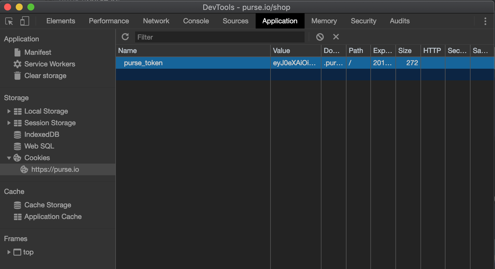

# Duffle 
Bulk order management for Purse.io

## Requirements
- nodejs
- npm
- git

## Getting Started
- `git clone git@github.com:dylanbathurst/duffle.git`
- `cd duffle`
- `npm install`
- `npm link`
- `duffle -h`

## Authentication
1. Log in to your account on [Purse.io](https://purse.io/)
1. In your browser's web inspector, look for the `purse_token` cookie and copy the contents. 
1. This token will used on the command line when using duffle. 

## Creating Orders
To create a bulk set of orders on Purse, create a `.csv` file and format it exactly like <a href="./examples/files/create.csv">this file</a> in the examples directory. Then run:
```
duffle --auth-token YOUR_PURSE_TOKEN create-orders /PATH/TO/YOUR/CSV/FILE.csv
```
example:
```
duffle --auth-token eyJ0eXAiOiJKV1QiLCJhbGciOiJIUzI1NiJ9.eyasdllkflkasdflaslljfjlJ1c2VyX2lkIjo2NzYsInVzZXJuYW1lIjoiZHlsYW5iYXRodXJzdCIsImV4cCI6MTU1MzE5MzUwMiwiZW1haWwiOiJkeWxhbmJhdGh1cnN0QGdtYWlsLmNvbSIsInNkIjoiZ2Z4M081T0kiLCJyIjo.iNkd4cmFoRWYiLCJkcyI6ImZVM create-orders examples/files/create.csv
```

## Modify Orders
To modify a bulk set of orders on Purse, create a `.csv` file and format it exactly like <a href="./examples/files/modify.csv">this file</a> in the examples directory. Then run:
```
duffle --auth-token YOUR_PURSE_TOKEN modify-orders /PATH/TO/YOUR/CSV/FILE.csv
```
example:
```
duffle --auth-token eyJ0eXAiOiJKV1QiLCJhbGciOiJIUzI1NiJ9.eyasdllkflkasdflaslljfjlJ1c2VyX2lkIjo2NzYsInVzZXJuYW1lIjoiZHlsYW5iYXRodXJzdCIsImV4cCI6MTU1MzE5MzUwMiwiZW1haWwiOiJkeWxhbmJhdGh1cnN0QGdtYWlsLmNvbSIsInNkIjoiZ2Z4M081T0kiLCJyIjo.iNkd4cmFoRWYiLCJkcyI6ImZVM modify-orders examples/files/modify.csv
```
Your console output will show the number of successful and unsuccessfully modified orders, as well as the response text for each order.

## Cancel Orders
To cancel a bulk set of orders on Purse, create a `.csv` file and format it exactly like <a href="./examples/files/cancel.csv">this file</a> in the examples directory. Then run:
```
duffle --auth-token YOUR_PURSE_TOKEN cancel-orders /PATH/TO/YOUR/CSV/FILE.csv
```
example:
```
duffle --auth-token eyJ0eXAiOiJKV1QiLCJhbGciOiJIUzI1NiJ9.eyasdllkflkasdflaslljfjlJ1c2VyX2lkIjo2NzYsInVzZXJuYW1lIjoiZHlsYW5iYXRodXJzdCIsImV4cCI6MTU1MzE5MzUwMiwiZW1haWwiOiJkeWxhbmJhdGh1cnN0QGdtYWlsLmNvbSIsInNkIjoiZ2Z4M081T0kiLCJyIjo.iNkd4cmFoRWYiLCJkcyI6ImZVM cancel-orders examples/files/cancel.csv
```
Your console output will show the number of successful and unsuccessfully canceled orders, as well as the response text for each order.

## Order Info
To get a bulk set of order information on Purse, create a `.csv` file and format it exactly like <a href="./examples/files/cancel.csv">this file</a> in the examples directory. Then run:

```
duffle --auth-token YOUR_PURSE_TOKEN orders-info /PATH/TO/YOUR/CSV/FILE.csv
```
example:
```
duffle --auth-token eyJ0eXAiOiJKV1QiLCJhbGciOiJIUzI1NiJ9.eyasdllkflkasdflaslljfjlJ1c2VyX2lkIjo2NzYsInVzZXJuYW1lIjoiZHlsYW5iYXRodXJzdCIsImV4cCI6MTU1MzE5MzUwMiwiZW1haWwiOiJkeWxhbmJhdGh1cnN0QGdtYWlsLmNvbSIsInNkIjoiZ2Z4M081T0kiLCJyIjo.iNkd4cmFoRWYiLCJkcyI6ImZVM orders-info examples/files/orders.csv
```
Your console output will show the number of successful and unsuccessful order info requests, as well as the order info for each order.


## Open Orders
To get a bulk set of open orders on Purse, run:

```
duffle --auth-token YOUR_PURSE_TOKEN open-orders
```
example:
```
duffle --auth-token eyJ0eXAiOiJKV1QiLCJhbGciOiJIUzI1NiJ9.eyasdllkflkasdflaslljfjlJ1c2VyX2lkIjo2NzYsInVzZXJuYW1lIjoiZHlsYW5iYXRodXJzdCIsImV4cCI6MTU1MzE5MzUwMiwiZW1haWwiOiJkeWxhbmJhdGh1cnN0QGdtYWlsLmNvbSIsInNkIjoiZ2Z4M081T0kiLCJyIjo.iNkd4cmFoRWYiLCJkcyI6ImZVM orders-info examples/files/orders.csv
```
with options:
```
duffle --auth-token YOUR_PURSE_TOKEN --limit 100 --offset 0 open-orders
```
run `duffle open-orders -h` for more options
Your console output will show the number of successful open orders, as well as the order info for each order.
